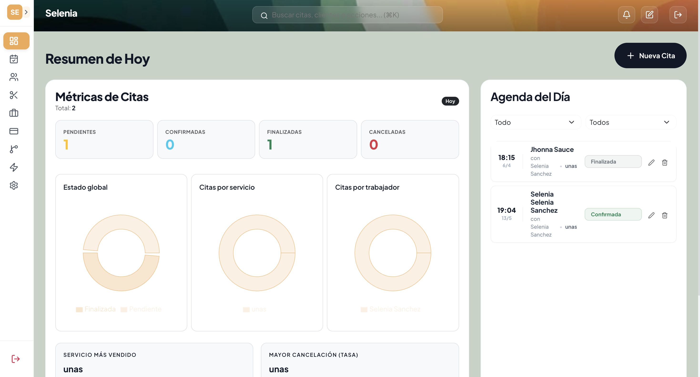
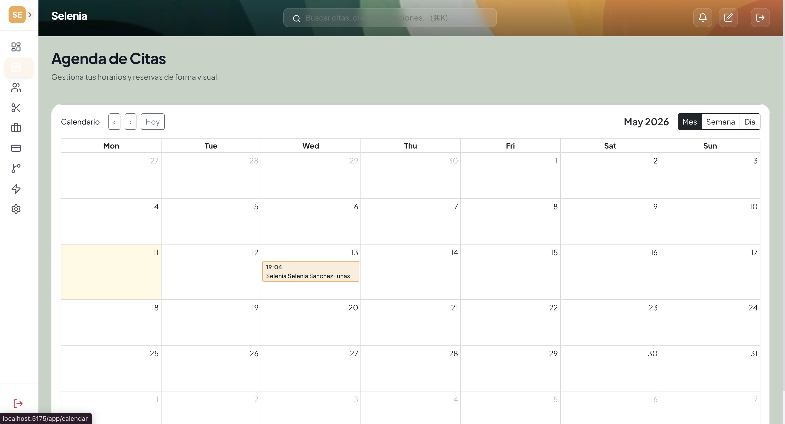
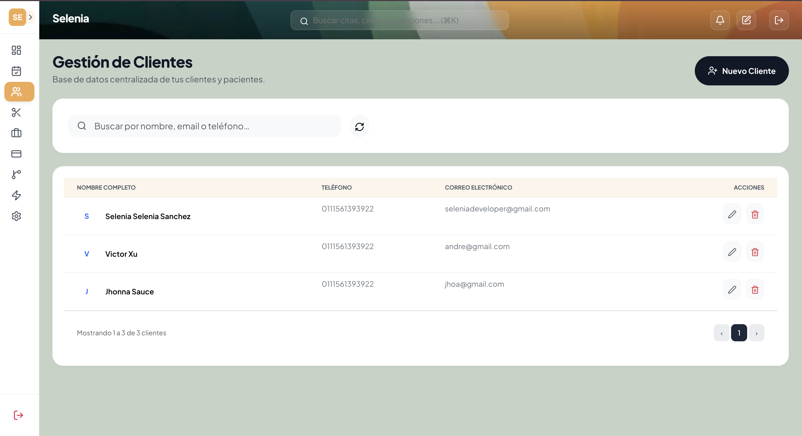
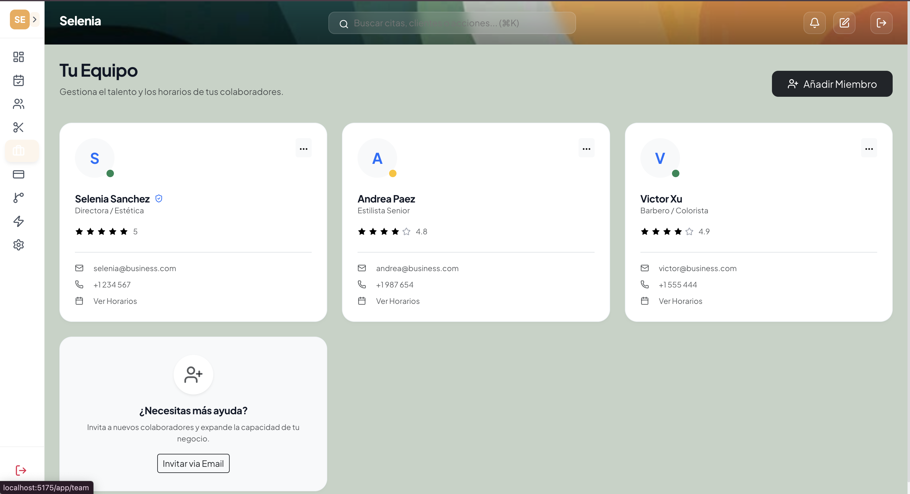
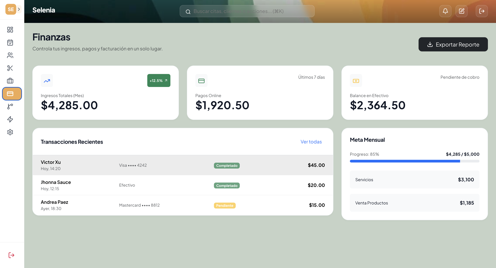
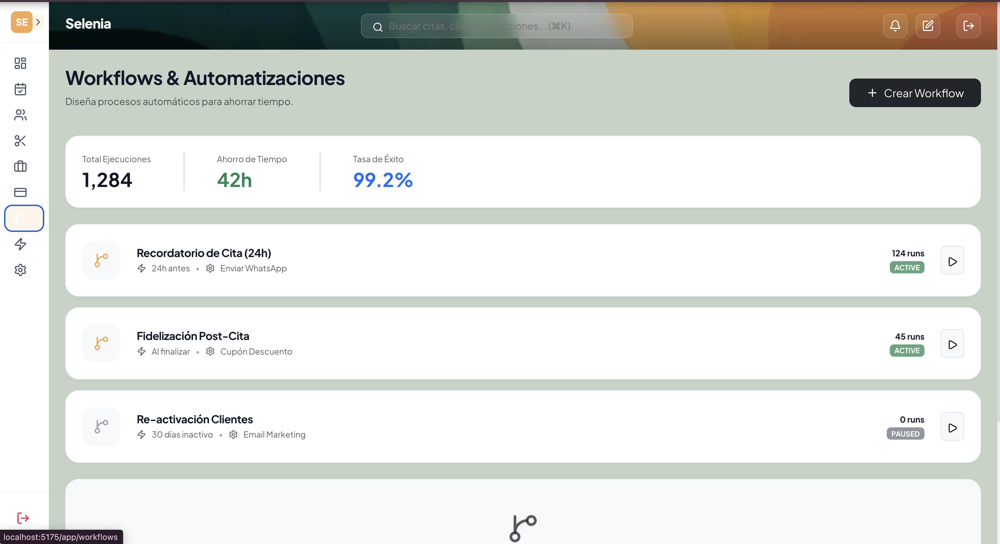

# 📖 Manual de Uso: Dashboard OS

Bienvenido a **Dashboard OS**, tu plataforma integral para la gestión empresarial. Este manual te guiará paso a paso a través de todas las funcionalidades del sistema para que puedas maximizar la eficiencia de tu negocio.

---

## 1. Resumen de Hoy (Panel Principal)
El corazón de tu negocio. Aquí obtendrás una vista rápida de tu rendimiento diario.

*   **Métricas de Citas**: Visualiza el estado de tus citas (Pendientes, Confirmadas, Finalizadas, Canceladas) en tiempo real.
*   **Gráficos de Distribución**: Analiza de dónde vienen tus ventas por servicio y trabajador.
*   **Agenda Rápida**: Accede directamente a las citas programadas para las próximas horas.

---

## 2. Gestión de la Agenda
Organiza tu tiempo de forma visual e intuitiva.

*   **Vistas Múltiples**: Cambia entre vista Mensual, Semanal o Diaria según tu necesidad.
*   **Nuevas Citas**: Haz clic en cualquier espacio vacío del calendario para abrir el formulario de creación.
*   **Estados por Colores**: Identifica rápidamente el estado de cada compromiso (Naranja: Pendiente, Verde: Confirmado, Gris: Finalizado).

---

## 3. Centro de Clientes
Mantén toda la información de tus clientes organizada y accesible.

*   **Buscador Inteligente**: Localiza clientes por nombre, email o teléfono en segundos.
*   **Historial Completo**: Accede al registro de todas las citas y preferencias de cada cliente.
*   **Acciones Rápidas**: Edita información o elimina registros directamente desde la tabla principal.

---

## 4. Gestión de Equipo
Administra a tus colaboradores y sus horarios.

*   **Tarjetas de Perfil**: Visualiza la especialidad, calificación y contacto de cada miembro.
*   **Horarios Personalizados**: Configura la disponibilidad de cada trabajador para evitar conflictos en la agenda.
*   **Invitaciones**: Añade nuevos miembros a tu equipo vía email de forma instantánea.

---

## 5. Control Financiero
Mide el crecimiento de tu negocio con datos reales.

*   **KPIs de Ingresos**: Controla tus ingresos totales, pagos online y balances en efectivo.
*   **Metas Mensuales**: Sigue tu progreso hacia tus objetivos financieros con barras de progreso visuales.
*   **Transacciones Recientes**: Un registro detallado de cada entrada de dinero para una contabilidad transparente.

---

## 6. Automatizaciones y Workflows
Deja que el sistema trabaje por ti.

*   **Recordatorios de WhatsApp**: Configura mensajes automáticos 24h antes de cada cita para reducir ausencias.
*   **Fidelización**: Envía cupones de descuento automáticamente después de que un cliente finalice su servicio.
*   **Bot de Reservas**: Activa un asistente virtual que agenda citas por ti las 24 horas del día.

---

## 💡 Consejos para el Éxito
1.  **Actualiza los estados**: Marcar las citas como "Finalizadas" asegura que tus métricas financieras sean precisas.
2.  **Usa etiquetas**: Clasifica a tus clientes para enviar campañas de marketing más efectivas.
3.  **Configura los recordatorios**: Una de las funciones más potentes es el recordatorio automático; ¡asegúrate de tenerlo activo!

---
*Dashboard OS &copy; 2026 - Elevando la gestión de tu negocio.*
